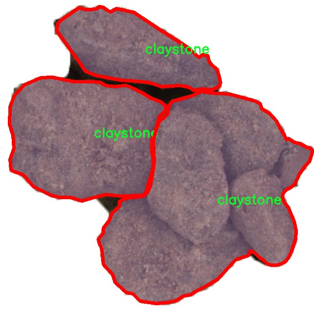

### 1.背景意义

研究背景与意义

随着计算机视觉技术的迅猛发展，实例分割作为一种重要的图像处理任务，越来越受到研究者和工业界的关注。实例分割不仅能够识别图像中的物体类别，还能精确地分割出每个物体的轮廓，为后续的图像分析和理解提供了丰富的信息。在众多实例分割算法中，YOLO（You Only Look Once）系列模型因其高效性和实时性而备受青睐。特别是YOLOv11的出现，进一步提升了目标检测和实例分割的性能，使其在各种应用场景中展现出强大的能力。

本研究旨在基于改进的YOLOv11模型，构建一个针对粘土石（claystone）实例分割的系统。粘土石作为一种重要的地质材料，广泛应用于建筑、工程和环境保护等领域。准确识别和分割粘土石的图像，不仅有助于地质勘探和资源评估，还能为环境监测和土壤保护提供科学依据。因此，开发一个高效的粘土石实例分割系统具有重要的理论价值和实际意义。

本项目所使用的数据集包含2600幅粘土石的图像，所有图像均经过精细标注，确保了模型训练的高质量。通过对数据集的深入分析与处理，我们可以有效提升模型的学习能力和泛化性能。此外，采用数据增强技术，能够进一步丰富训练样本，提高模型在不同环境下的适应性。

在此背景下，基于改进YOLOv11的粘土石实例分割系统的研究，不仅能够推动计算机视觉技术在地质领域的应用，也为实例分割技术的进一步发展提供了新的思路和方法。通过本研究，我们期望能够为相关领域的研究者和工程师提供一种高效、可靠的工具，助力于更好地理解和利用粘土石资源。

### 2.视频效果

[2.1 视频效果](https://www.bilibili.com/video/BV1LSq3YfEtJ/)

### 3.图片效果


##### [项目涉及的源码数据来源链接](https://kdocs.cn/l/cszuIiCKVNis)**

注意：本项目提供训练的数据集和训练教程,由于版本持续更新,暂不提供权重文件（best.pt）,请按照6.训练教程进行训练后实现上图演示的效果。

### 4.数据集信息

##### 4.1 本项目数据集类别数＆类别名

nc: 1
names: ['claystone']


该项目为【图像分割】数据集，请在【训练教程和Web端加载模型教程（第三步）】这一步的时候按照【图像分割】部分的教程来训练

##### 4.2 本项目数据集信息介绍

本项目数据集信息介绍

本项目所使用的数据集名为“claystone_UniversityDesign”，旨在为改进YOLOv11的粘土石实例分割系统提供高质量的训练数据。该数据集专注于单一类别的物体识别与分割，具体类别为“claystone”，其独特的地质特征使其在环境科学、地质工程以及材料科学等领域具有重要的研究价值。数据集中包含了多种不同形态、颜色和纹理的粘土石样本，这些样本通过精心的采集和标注，确保了数据的多样性和代表性。

在数据集的构建过程中，研究团队采用了高分辨率的图像采集技术，以捕捉粘土石的细微特征。这些图像不仅涵盖了不同光照条件下的样本，还包括了多种背景环境，旨在提高模型在实际应用中的鲁棒性和适应性。此外，数据集中的每一张图像都经过了严格的标注，确保每个粘土石实例都能被准确识别和分割。这种精细的标注工作为YOLOv11模型的训练提供了坚实的基础，使其能够有效地学习到粘土石的特征。

通过使用“claystone_UniversityDesign”数据集，研究人员希望能够显著提升YOLOv11在粘土石实例分割任务中的性能。该数据集不仅为模型的训练提供了丰富的样本，还为后续的测试和验证提供了可靠的数据支持。最终，期望通过本项目的研究成果，推动粘土石相关领域的自动化识别与分析技术的发展，为地质研究和工程应用提供更为高效的解决方案。





### 5.全套项目环境部署视频教程（零基础手把手教学）

[5.1 所需软件PyCharm和Anaconda安装教程（第一步）](https://www.bilibili.com/video/BV1BoC1YCEKi/?spm_id_from=333.999.0.0&vd_source=bc9aec86d164b67a7004b996143742dc)


[5.2 安装Python虚拟环境创建和依赖库安装视频教程（第二步）](https://www.bilibili.com/video/BV1ZoC1YCEBw?spm_id_from=333.788.videopod.sections&vd_source=bc9aec86d164b67a7004b996143742dc)

### 6.改进YOLOv11训练教程和Web_UI前端加载模型教程（零基础手把手教学）

[6.1 改进YOLOv11训练教程和Web_UI前端加载模型教程（第三步）](https://www.bilibili.com/video/BV1BoC1YCEhR?spm_id_from=333.788.videopod.sections&vd_source=bc9aec86d164b67a7004b996143742dc)


按照上面的训练视频教程链接加载项目提供的数据集，运行train.py即可开始训练



     Epoch   gpu_mem       box       obj       cls    labels  img_size
     1/200     20.8G   0.01576   0.01955  0.007536        22      1280: 100%|██████████| 849/849 [14:42<00:00,  1.04s/it]
               Class     Images     Labels          P          R     mAP@.5 mAP@.5:.95: 100%|██████████| 213/213 [01:14<00:00,  2.87it/s]
                 all       3395      17314      0.994      0.957      0.0957      0.0843

     Epoch   gpu_mem       box       obj       cls    labels  img_size
     2/200     20.8G   0.01578   0.01923  0.007006        22      1280: 100%|██████████| 849/849 [14:44<00:00,  1.04s/it]
               Class     Images     Labels          P          R     mAP@.5 mAP@.5:.95: 100%|██████████| 213/213 [01:12<00:00,  2.95it/s]
                 all       3395      17314      0.996      0.956      0.0957      0.0845

     Epoch   gpu_mem       box       obj       cls    labels  img_size
     3/200     20.8G   0.01561    0.0191  0.006895        27      1280: 100%|██████████| 849/849 [10:56<00:00,  1.29it/s]
               Class     Images     Labels          P          R     mAP@.5 mAP@.5:.95: 100%|███████   | 187/213 [00:52<00:00,  4.04it/s]
                 all       3395      17314      0.996      0.957      0.0957      0.0845


###### [项目数据集下载链接](https://kdocs.cn/l/cszuIiCKVNis)

### 7.原始YOLOv11算法讲解


其实到了YOLOV11 基本创新点就不太多了，主要就是大家互相排列组合复用不同的网络模块、损失函数和样本匹配策略，需要注意YOLO V5、V8 V11
都是1个公司的，其余的个人建议看看V8的，剩下的了解就好。

V11支持多种视觉任务：物体检测、实例分割、图像分类、姿态估计和定向物体检测（OBB）。

##### YOLOv11
基本和YOLOV8同源，甚至git目前都是1个，部分代码注释还是YOLOV8的，所以建议先看我写的YOLOV8相关博客，对比YOLOV8主要涉及到：

*backbone 中的使用C2f模块 变为 c3k2 模块。

*backbone 中的最后一层（sppf层）后增加了C2PSA模块。

*head 解耦头中的分类检测头两个Conv 变为 DWConv。

整体技术而言：

*backbone 使用了C2K2模块+最后SPPF模块级联C2PSA模块；

*neck 使用PAN结构，并且里面也使用C3K2模块；

*head使用了anchor-free + Decoupled-head，其中回归头使用正常的卷积，分类头使用DWConv；

*损失函数使用了分类BCE、回归CIOU + VFL的组合；

*框匹配策略由静态匹配改为了Task-Aligned Assigner匹配方式；

*训练策略没有提及，其中YOLOV8可以参考如下最后 10 个 epoch 关闭 Mosaic 的操作、训练总 epoch 数从 300 提升到了 500。

##### 主要思路


配置文件：[ultralytics/ultralytics/cfg/models/11/yolo11.yaml at main ·
ultralytics/ultralytics ·
GitHub](https://github.com/ultralytics/ultralytics/blob/main/ultralytics/cfg/models/11/yolo11.yaml
"ultralytics/ultralytics/cfg/models/11/yolo11.yaml at main ·
ultralytics/ultralytics · GitHub")

解析函数：[ultralytics/ultralytics/nn/tasks.py at main · ultralytics/ultralytics ·
GitHub](https://github.com/ultralytics/ultralytics/blob/main/ultralytics/nn/tasks.py#L934
"ultralytics/ultralytics/nn/tasks.py at main · ultralytics/ultralytics ·
GitHub")


##### 具体细节

##### input

输入要求以及预处理，可选项比较多，可以参考这个配置文件：[ultralytics/ultralytics/cfg/default.yaml at main
· ultralytics/ultralytics ·
GitHub](https://github.com/ultralytics/ultralytics/blob/main/ultralytics/cfg/default.yaml
"ultralytics/ultralytics/cfg/default.yaml at main · ultralytics/ultralytics ·
GitHub") 的Hyperparameters 部分。

基础输入仍然为640*640。预处理就是熟悉的letterbox（根据参数配置可以为不同的缩放填充模式，主要用于resize到640）+
转换rgb、chw、int8(0-255)->float（0-1），注意没有归一化操作。需要注意的是作者实现的mosaic和网上看到的不同，对比如下图（左边网上版本，右边是YOLO的实现）。并且作者添加了在最后10轮关闭mosaic增强（YOLOV8开始支持，具体原因个人的经验如我的这篇文章：yolov5
mosaic相关，关闭参数在 Train settings 部分的close_mosaic 选项）


##### backbone

主干网络以及改进

这里不去特意强调对比YOLOv5、V8等等的改进，因为各个系列都在疯狂演进，个人认为没必要花费时间看差异，着重看看一些比较重要的模块即可。源代码：

大多数模块：[ultralytics/ultralytics/nn/modules/block.py at main ·
ultralytics/ultralytics ·
GitHub](https://github.com/ultralytics/ultralytics/blob/main/ultralytics/nn/modules/block.py
"ultralytics/ultralytics/nn/modules/block.py at main · ultralytics/ultralytics
· GitHub")

head 部分：[ultralytics/ultralytics/nn/modules/head.py at main ·
ultralytics/ultralytics ·
GitHub](https://github.com/ultralytics/ultralytics/blob/main/ultralytics/nn/modules/head.py
"ultralytics/ultralytics/nn/modules/head.py at main · ultralytics/ultralytics
· GitHub")

串联模块构造网络：[ultralytics/ultralytics/nn/tasks.py at main ·
ultralytics/ultralytics ·
GitHub](https://github.com/ultralytics/ultralytics/blob/main/ultralytics/nn/tasks.py
"ultralytics/ultralytics/nn/tasks.py at main · ultralytics/ultralytics ·
GitHub")

##### 1）CBS 模块（后面叫做Conv）

就是pytorch 自带的conv + BN +SiLU，这里对应上面的配置文件的Conv 的 args 比如[64, 3, 2] 就是 conv2d
的c2=64、k=3、 s =2、c1 自动为上一层参数、p 为自动计算，真实需要计算scales 里面的with 和 max_channels 缩放系数。

这里连续使用两个3*3卷积stride为2的CBS模块直接横竖各降低了4倍分辨率（整体变为原来1/16）。这个还是比较猛的，敢在如此小的感受野下连续两次仅仅用一层卷积就下采样,当然作为代价它的特征图还是比较厚的分别为16、32。


    
    
        class Conv(nn.Module):
        """Standard convolution with args(ch_in, ch_out, kernel, stride, padding, groups, dilation, activation)."""
    
        default_act = nn.SiLU()  # default activation
    
        def __init__(self, c1, c2, k=1, s=1, p=None, g=1, d=1, act=True):
            """Initialize Conv layer with given arguments including activation."""
            super().__init__()
            self.conv = nn.Conv2d(c1, c2, k, s, autopad(k, p, d), groups=g, dilation=d, bias=False)
            self.bn = nn.BatchNorm2d(c2)
            self.act = self.default_act if act is True else act if isinstance(act, nn.Module) else nn.Identity()
    
        def forward(self, x):
            """Apply convolution, batch normalization and activation to input tensor."""
            return self.act(self.bn(self.conv(x)))
    
        def forward_fuse(self, x):
            """Perform transposed convolution of 2D data."""
            return self.act(self.conv(x))

##### 2）c3k2 模块

##### Bottleneck

有两种结构，需要参数shortcut和两个conv的宽度是否相同来控制。

##### C3 & C3K

都是CSP bottleneck module with 3 convolutions, C3 代表3个卷积层，
K代表其中bottleneck中的卷积核为支持自定义，其实这里c3k作者使用的默认的3*3卷积核也就等同于使用c3(c3是3*3卷积核)。

##### c2f & c3k2

其实也就是仿照YOLOv7 的ELAN
结构，通过更多的分支夸层链接，丰富了模型的梯度流。C3K2模块其实就是C2F模块转变出来的，它代码中有一个设置，就是当c3k这个参数为FALSE的时候，C3K2模块就是C2F模块，也就是说它的Bottleneck是普通的Bottleneck；反之当它为true的时候，将Bottleneck模块替换成C3K模块。模块中存在
Split 等操作对特定硬件部署没有之前那么友好了。需要针对自己的硬件进行测试看对最终推理速度的影响。

可视化关系如下，这里需要注意配置文件中的参数，比如21行[-1, 2, C3k2, [512, False, 0.25]]
512代表宽度、false代表是否使用shortcut、0.25代表c2f的宽度缩放。也就是第一个Conv的输出宽度。


源代码如下:

    
    
    class Bottleneck(nn.Module):
        """Standard bottleneck."""
    
        def __init__(self, c1, c2, shortcut=True, g=1, k=(3, 3), e=0.5):
            """Initializes a standard bottleneck module with optional shortcut connection and configurable parameters."""
            super().__init__()
            c_ = int(c2 * e)  # hidden channels
            self.cv1 = Conv(c1, c_, k[0], 1)
            self.cv2 = Conv(c_, c2, k[1], 1, g=g)
            self.add = shortcut and c1 == c2
    
        def forward(self, x):
            """Applies the YOLO FPN to input data."""
            return x + self.cv2(self.cv1(x)) if self.add else self.cv2(self.cv1(x))
    
    class C3(nn.Module):
        """CSP Bottleneck with 3 convolutions."""
    
        def __init__(self, c1, c2, n=1, shortcut=True, g=1, e=0.5):
            """Initialize the CSP Bottleneck with given channels, number, shortcut, groups, and expansion values."""
            super().__init__()
            c_ = int(c2 * e)  # hidden channels
            self.cv1 = Conv(c1, c_, 1, 1)
            self.cv2 = Conv(c1, c_, 1, 1)
            self.cv3 = Conv(2 * c_, c2, 1)  # optional act=FReLU(c2)
            self.m = nn.Sequential(*(Bottleneck(c_, c_, shortcut, g, k=((1, 1), (3, 3)), e=1.0) for _ in range(n)))
    
        def forward(self, x):
            """Forward pass through the CSP bottleneck with 2 convolutions."""
            return self.cv3(torch.cat((self.m(self.cv1(x)), self.cv2(x)), 1))
    
    class C3k(C3):
        """C3k is a CSP bottleneck module with customizable kernel sizes for feature extraction in neural networks."""
    
        def __init__(self, c1, c2, n=1, shortcut=True, g=1, e=0.5, k=3):
            """Initializes the C3k module with specified channels, number of layers, and configurations."""
            super().__init__(c1, c2, n, shortcut, g, e)
            c_ = int(c2 * e)  # hidden channels
            # self.m = nn.Sequential(*(RepBottleneck(c_, c_, shortcut, g, k=(k, k), e=1.0) for _ in range(n)))
            self.m = nn.Sequential(*(Bottleneck(c_, c_, shortcut, g, k=(k, k), e=1.0) for _ in range(n)))
    
    class C2f(nn.Module):
        """Faster Implementation of CSP Bottleneck with 2 convolutions."""
    
        def __init__(self, c1, c2, n=1, shortcut=False, g=1, e=0.5):
            """Initializes a CSP bottleneck with 2 convolutions and n Bottleneck blocks for faster processing."""
            super().__init__()
            self.c = int(c2 * e)  # hidden channels
            self.cv1 = Conv(c1, 2 * self.c, 1, 1)
            self.cv2 = Conv((2 + n) * self.c, c2, 1)  # optional act=FReLU(c2)
            self.m = nn.ModuleList(Bottleneck(self.c, self.c, shortcut, g, k=((3, 3), (3, 3)), e=1.0) for _ in range(n))
    
        def forward(self, x):
            """Forward pass through C2f layer."""
            y = list(self.cv1(x).chunk(2, 1))
            y.extend(m(y[-1]) for m in self.m)
            return self.cv2(torch.cat(y, 1))
    
        def forward_split(self, x):
            """Forward pass using split() instead of chunk()."""
            y = list(self.cv1(x).split((self.c, self.c), 1))
            y.extend(m(y[-1]) for m in self.m)
            return self.cv2(torch.cat(y, 1))
    
    class C3k2(C2f):
        """Faster Implementation of CSP Bottleneck with 2 convolutions."""
    
        def __init__(self, c1, c2, n=1, c3k=False, e=0.5, g=1, shortcut=True):
            """Initializes the C3k2 module, a faster CSP Bottleneck with 2 convolutions and optional C3k blocks."""
            super().__init__(c1, c2, n, shortcut, g, e)
            self.m = nn.ModuleList(
                C3k(self.c, self.c, 2, shortcut, g) if c3k else Bottleneck(self.c, self.c, shortcut, g) for _ in range(n)
            )

##### 3）sppf 模块

对比spp，将简单的并行max pooling 改为串行+并行的方式。对比如下（左边是SPP，右边是SPPF）：


    
    
        class SPPF(nn.Module):
        # Spatial Pyramid Pooling - Fast (SPPF) layer for YOLOv5 by Glenn Jocher
        def __init__(self, c1, c2, k=5):  # equivalent to SPP(k=(5, 9, 13))
            super().__init__()
            c_ = c1 // 2  # hidden channels
            self.cv1 = Conv(c1, c_, 1, 1)
            self.cv2 = Conv(c_ * 4, c2, 1, 1)
            self.m = nn.MaxPool2d(kernel_size=k, stride=1, padding=k // 2)
    
        def forward(self, x):
            x = self.cv1(x)
            with warnings.catch_warnings():
                warnings.simplefilter('ignore')  # suppress torch 1.9.0 max_pool2d() warning
                y1 = self.m(x)
                y2 = self.m(y1)
                return self.cv2(torch.cat((x, y1, y2, self.m(y2)), 1))

##### 4）C2PSA 模块

C2PSA它结合了PSA(Pointwise Spatial
Attention)块，用于增强特征提取和注意力机制。下面的图建议从左到右看，这样才能更有条理的理解，其实PSA个人感觉就是仿着VIT
的Attention来做的，是把输入C2PSA的特征图的h*w 看做VIT 的path数（也可以理解为NLP中token 个数），特征图的channel
数看做VIT特征维度（CNN的宽度，或者理解为NLP中token
编码后的特征维度），然后计算出QKV（这里需要注意第四幅图的QKV是值，不是操作，所以标注成了圆角矩形，这里是为了大家好理解），这里的Attention其实是在h*w维度计算空间Attention，个人感觉是强制给了全局感受野，并且并联了一个3*3的深度可分离卷积的单空间部分，就是仅在每一个特征图上进行3*3卷积，具体实现是通过pytorch
conv2d 的
group参数设置为特征图的通道数。特别的关于Conv的参数分别为：输入通道数、输出通道数、卷积核尺寸、pad尺寸、group数、是否有激活函数（默认silu）。图中的最后一幅省略了一些细节，可以参考源码。

注意区别C2fPSA，C2fPSA才是对 C2f 模块的扩展，通过在标准 C2f 模块中引入 PSA
块，C2fPSA实现了更强大的注意力机制，从而提高了模型对重要特征的捕捉能力。作者实现了该模块但最终没有使用。


涉及的源码：

    
    
    class Attention(nn.Module):
        """
        Attention module that performs self-attention on the input tensor.
    
        Args:
            dim (int): The input tensor dimension.
            num_heads (int): The number of attention heads.
            attn_ratio (float): The ratio of the attention key dimension to the head dimension.
    
        Attributes:
            num_heads (int): The number of attention heads.
            head_dim (int): The dimension of each attention head.
            key_dim (int): The dimension of the attention key.
            scale (float): The scaling factor for the attention scores.
            qkv (Conv): Convolutional layer for computing the query, key, and value.
            proj (Conv): Convolutional layer for projecting the attended values.
            pe (Conv): Convolutional layer for positional encoding.
        """
    
        def __init__(self, dim, num_heads=8, attn_ratio=0.5):
            """Initializes multi-head attention module with query, key, and value convolutions and positional encoding."""
            super().__init__()
            self.num_heads = num_heads
            self.head_dim = dim // num_heads
            self.key_dim = int(self.head_dim * attn_ratio)
            self.scale = self.key_dim**-0.5
            nh_kd = self.key_dim * num_heads
            h = dim + nh_kd * 2
            self.qkv = Conv(dim, h, 1, act=False)
            self.proj = Conv(dim, dim, 1, act=False)
            self.pe = Conv(dim, dim, 3, 1, g=dim, act=False)
    
        def forward(self, x):
            """
            Forward pass of the Attention module.
    
            Args:
                x (torch.Tensor): The input tensor.
    
            Returns:
                (torch.Tensor): The output tensor after self-attention.
            """
            B, C, H, W = x.shape
            N = H * W
            qkv = self.qkv(x)
            q, k, v = qkv.view(B, self.num_heads, self.key_dim * 2 + self.head_dim, N).split(
                [self.key_dim, self.key_dim, self.head_dim], dim=2
            )
    
            attn = (q.transpose(-2, -1) @ k) * self.scale
            attn = attn.softmax(dim=-1)
            x = (v @ attn.transpose(-2, -1)).view(B, C, H, W) + self.pe(v.reshape(B, C, H, W))
            x = self.proj(x)
            return x
    
    class PSABlock(nn.Module):
        """
        PSABlock class implementing a Position-Sensitive Attention block for neural networks.
    
        This class encapsulates the functionality for applying multi-head attention and feed-forward neural network layers
        with optional shortcut connections.
    
        Attributes:
            attn (Attention): Multi-head attention module.
            ffn (nn.Sequential): Feed-forward neural network module.
            add (bool): Flag indicating whether to add shortcut connections.
    
        Methods:
            forward: Performs a forward pass through the PSABlock, applying attention and feed-forward layers.
    
        Examples:
            Create a PSABlock and perform a forward pass
            >>> psablock = PSABlock(c=128, attn_ratio=0.5, num_heads=4, shortcut=True)
            >>> input_tensor = torch.randn(1, 128, 32, 32)
            >>> output_tensor = psablock(input_tensor)
        """
    
        def __init__(self, c, attn_ratio=0.5, num_heads=4, shortcut=True) -> None:
            """Initializes the PSABlock with attention and feed-forward layers for enhanced feature extraction."""
            super().__init__()
    
            self.attn = Attention(c, attn_ratio=attn_ratio, num_heads=num_heads)
            self.ffn = nn.Sequential(Conv(c, c * 2, 1), Conv(c * 2, c, 1, act=False))
            self.add = shortcut
    
        def forward(self, x):
            """Executes a forward pass through PSABlock, applying attention and feed-forward layers to the input tensor."""
            x = x + self.attn(x) if self.add else self.attn(x)
            x = x + self.ffn(x) if self.add else self.ffn(x)
            return x
        
    class C2PSA(nn.Module):
        """
        C2PSA module with attention mechanism for enhanced feature extraction and processing.
    
        This module implements a convolutional block with attention mechanisms to enhance feature extraction and processing
        capabilities. It includes a series of PSABlock modules for self-attention and feed-forward operations.
    
        Attributes:
            c (int): Number of hidden channels.
            cv1 (Conv): 1x1 convolution layer to reduce the number of input channels to 2*c.
            cv2 (Conv): 1x1 convolution layer to reduce the number of output channels to c.
            m (nn.Sequential): Sequential container of PSABlock modules for attention and feed-forward operations.
    
        Methods:
            forward: Performs a forward pass through the C2PSA module, applying attention and feed-forward operations.
    
        Notes:
            This module essentially is the same as PSA module, but refactored to allow stacking more PSABlock modules.
    
        Examples:
            >>> c2psa = C2PSA(c1=256, c2=256, n=3, e=0.5)
            >>> input_tensor = torch.randn(1, 256, 64, 64)
            >>> output_tensor = c2psa(input_tensor)
        """
    
        def __init__(self, c1, c2, n=1, e=0.5):
            """Initializes the C2PSA module with specified input/output channels, number of layers, and expansion ratio."""
            super().__init__()
            assert c1 == c2
            self.c = int(c1 * e)
            self.cv1 = Conv(c1, 2 * self.c, 1, 1)
            self.cv2 = Conv(2 * self.c, c1, 1)
    
            self.m = nn.Sequential(*(PSABlock(self.c, attn_ratio=0.5, num_heads=self.c // 64) for _ in range(n)))
    
        def forward(self, x):
            """Processes the input tensor 'x' through a series of PSA blocks and returns the transformed tensor."""
            a, b = self.cv1(x).split((self.c, self.c), dim=1)
            b = self.m(b)
            return self.cv2(torch.cat((a, b), 1))

##### 3、neck & head

##### 1）检测头

YOLOV11 Head 部分和YOLOV8是近似的，所以简单对比YOLOV5、V8、V11。


如上面图，上边是YOLOV5 的结构，中是YOLOv8 的结构，下面是YOLOV11 结构

Yolov5: 检测和分类共用一个卷积（coupled head）并且是anchor based ,其 卷积输出为（5+N class）*3，其中
5为bbox 四个值（具体代表什么不同版本略有不同，官方git有说明，历史版本见 目标检测算法——YOLOV5 ）+ 一个obj 值
（是否有目标，这个是从YOLO V1 传承下来的，个人感觉有点绕和不合理，并且后面取消），N class 为类别数，3为anchor 的数量，默认是3个。

YOLOv8：检测和分类的卷积是解耦的（decoupled），如中图，上面一条卷积支路是回归框，框的特征图channel为4*regmax，关于这个regmax
后面我们详细的解释,并不是anchor；分类的channel 为类别数。

YOLOV11：检测和分类的卷积是解耦的（decoupled），如右图，上面一条卷积支路是回归框，框的特征图channel为4*regmax，关于这个regmax
后面我们详细的解释,并不是anchor；分类的channel 为类别数，分类使用深度可分离卷积替代常规卷积降低计算量。

源码部分如下

    
    
    class Detect(nn.Module):
        """YOLO Detect head for detection models."""
    
        dynamic = False  # force grid reconstruction
        export = False  # export mode
        end2end = False  # end2end
        max_det = 300  # max_det
        shape = None
        anchors = torch.empty(0)  # init
        strides = torch.empty(0)  # init
    
        def __init__(self, nc=80, ch=()):
            """Initializes the YOLO detection layer with specified number of classes and channels."""
            super().__init__()
            self.nc = nc  # number of classes
            self.nl = len(ch)  # number of detection layers
            self.reg_max = 16  # DFL channels (ch[0] // 16 to scale 4/8/12/16/20 for n/s/m/l/x)
            self.no = nc + self.reg_max * 4  # number of outputs per anchor
            self.stride = torch.zeros(self.nl)  # strides computed during build
            c2, c3 = max((16, ch[0] // 4, self.reg_max * 4)), max(ch[0], min(self.nc, 100))  # channels
            self.cv2 = nn.ModuleList(
                nn.Sequential(Conv(x, c2, 3), Conv(c2, c2, 3), nn.Conv2d(c2, 4 * self.reg_max, 1)) for x in ch
            )
            self.cv3 = nn.ModuleList(
                nn.Sequential(
                    nn.Sequential(DWConv(x, x, 3), Conv(x, c3, 1)),
                    nn.Sequential(DWConv(c3, c3, 3), Conv(c3, c3, 1)),
                    nn.Conv2d(c3, self.nc, 1),
                )
                for x in ch
            )
            self.dfl = DFL(self.reg_max) if self.reg_max > 1 else nn.Identity()
    
            if self.end2end:
                self.one2one_cv2 = copy.deepcopy(self.cv2)
                self.one2one_cv3 = copy.deepcopy(self.cv3)
    
        def forward(self, x):
            """Concatenates and returns predicted bounding boxes and class probabilities."""
            if self.end2end:
                return self.forward_end2end(x)
    
            for i in range(self.nl):
                x[i] = torch.cat((self.cv2[i](x[i]), self.cv3[i](x[i])), 1)
            if self.training:  # Training path
                return x
            y = self._inference(x)
            return y if self.export else (y, x)

因此主要的变化可以认为有三个：（1）coupled head -> decoupled head ；（2）obj 分支消失；（3）anchor
based——> anchor free ; 4) 深度可分离卷积。

（1）coupled head -> decoupled head

这个解耦操作，看YOLO x 的论文，约有1% 的提升。逻辑和实现都比较直观易懂，不再赘述。

（2）obj 分支消失；

这个其实我自己再看YOLO V1 的时候就有疑问，它存在的意义。后来人们发现，其实obj
的在训练和推理过程中存在逻辑不一致性。具体而言（摘自“<https://zhuanlan.zhihu.com/p/147691786>”）

A。用法不一致。训练的时候，分类和质量估计各自训练自个儿的，但测试的时候却又是乘在一起作为NMS score排序的依据，这个操作显然没有end-to-
end，必然存在一定的gap。（个人认为还好，就是两个监督信号）

B。对象不一致。借助Focal
Loss的力量，分类分支能够使得少量的正样本和大量的负样本一起成功训练，但是质量估计通常就只针对正样本训练。那么，对于one-
stage的检测器而言，在做NMS
score排序的时候，所有的样本都会将分类score和质量预测score相乘用于排序，那么必然会存在一部分分数较低的“负样本”的质量预测是没有在训练过程中有监督信号的，对于大量可能的负样本，他们的质量预测是一个未定义行为。这就很有可能引发这么一个情况：一个分类score相对低的真正的负样本，由于预测了一个不可信的极高的质量score，而导致它可能排到一个真正的正样本（分类score不够高且质量score相对低）的前面。问题一如图所示：


（3）anchor based——> anchor free

这里主要涉及怎么定义回归内容以及如何匹配GT框的问题。也就是如下：

##### 2）匹配策略

A。回归的内容当前版本就是回归的lftp四个值（这四个值是距离匹配到的anchor 点的距离值！不是图片的绝对位置）。后面推理阶段通过
dist2bbox函数转换为需要的格式：

[
https://github.com/ultralytics/ultralytics/blob/cc3c774bde86ffce694d202b7383da6cc1721c1b/ultralytics/nn/modules.py#L378](https://github.com/ultralytics/ultralytics/blob/cc3c774bde86ffce694d202b7383da6cc1721c1b/ultralytics/nn/modules.py#L378
"  
 https://github.com/ultralytics/ultralytics/blob/cc3c774bde86ffce694d202b7383da6cc1721c1b/ultralytics/nn/modules.py#L378")

[
https://github.com/ultralytics/ultralytics/blob/cc3c774bde86ffce694d202b7383da6cc1721c1b/ultralytics/yolo/utils/tal.py#L196](https://github.com/ultralytics/ultralytics/blob/cc3c774bde86ffce694d202b7383da6cc1721c1b/ultralytics/yolo/utils/tal.py#L196
"  
 https://github.com/ultralytics/ultralytics/blob/cc3c774bde86ffce694d202b7383da6cc1721c1b/ultralytics/yolo/utils/tal.py#L196")。

    
    
       def dist2bbox(distance, anchor_points, xywh=True, dim=-1):
        """Transform distance(ltrb) to box(xywh or xyxy)."""
        lt, rb = torch.split(distance, 2, dim)
        x1y1 = anchor_points - lt
        x2y2 = anchor_points + rb
        if xywh:
            c_xy = (x1y1 + x2y2) / 2
            wh = x2y2 - x1y1
            return torch.cat((c_xy, wh), dim)  # xywh bbox
        return torch.cat((x1y1, x2y2), dim)  # xyxy bbox

##### B.匹配策略

YOLOv5 采用静态的匹配策略，V8采用了动态的TaskAlignedAssigner，其余常见的动态匹配还有： YOLOX 的 simOTA、TOOD
的 TaskAlignedAssigner 和 RTMDet 的 DynamicSoftLabelAssigner。


TaskAligned使用分类得分和IoU的高阶组合来衡量Task-Alignment的程度。使用上面公式来对每个实例计算Anchor-level
的对齐程度：s 和 u 分别为分类得分和 IoU 值，α 和 β 为权重超参。t 可以同时控制分类得分和IoU 的优化来实现 Task-
Alignment，可以引导网络动态的关注于高质量的Anchor。采用一种简单的分配规则选择训练样本：对每个实例，选择m个具有最大t值的Anchor作为正样本，选择其余的Anchor作为负样本。然后，通过损失函数(针对分类与定位的对齐而设计的损失函数)进行训练。

代码地址：[ultralytics/ultralytics/yolo/utils/tal.py at
c0c0c138c12699807ff9446f942cb3bd325d670b · ultralytics/ultralytics ·
GitHub](https://github.com/ultralytics/ultralytics/blob/c0c0c138c12699807ff9446f942cb3bd325d670b/ultralytics/yolo/utils/tal.py#L56
"ultralytics/ultralytics/yolo/utils/tal.py at
c0c0c138c12699807ff9446f942cb3bd325d670b · ultralytics/ultralytics · GitHub")

默认参数如下（当前版本这些超参没有提供修改的接口，如需修改需要在源码上进行修改）：


##### 4、loss function

损失函数设计

Loss 计算包括 2 个分支： 分类和回归分支，没有了之前的 objectness 分支。

分类分支依然采用 BCE Loss。回归分支使用了 Distribution Focal Loss（DFL Reg_max默认为16）+ CIoU
Loss。3 个 Loss
采用一定权重比例加权即可（默认如下：<https://github.com/ultralytics/ultralytics/blob/main/ultralytics/yolo/configs/default.yaml#L83>）。


这里重点介绍一下DFL损失。目前被广泛使用的bbox表示可以看作是对bbox方框坐标建模了单一的狄拉克分布。但是在复杂场景中，一些检测对象的边界并非十分明确。如下图左面所示，对于滑板左侧被水花模糊，引起对左边界的预测分布是任意而扁平的，对右边界的预测分布是明确而尖锐的。对于这个问题，有学者提出直接回归一个任意分布来建模边界框，使用softmax实现离散的回归，将狄拉克分布的积分形式推导到一般形式的积分形式来表示边界框。


狄拉克分布可以认为在一个点概率密度为无穷大，其他点概率密度为0，这是一种极端地认为离散的标签时绝对正确的。


因为标签是一个离散的点，如果把标签认为是绝对正确的目标，那么学习出的就是狄拉克分布，概率密度是一条尖锐的竖线。然而真实场景，物体边界并非是十分明确的，因此学习一个宽范围的分布更为合理。我们需要获得的分布虽然不再像狄拉克分布那么极端（只存在标签值），但也应该在标签值附近。因此学者提出Distribution
Focal
Loss损失函数，目的让网络快速聚焦到标签附近的数值，是标签处的概率密度尽量大。思想是使用交叉熵函数，来优化标签y附近左右两个位置的概率，是网络分布聚焦到标签值附近。如下公式。Si
是网络的sigmod 输出（因为真是是多分类，所以是softmax），yi 和 yi+1 是上图的区间顺序，y是label
值。

具体而言，针对我们将DFL的超参数Reg_max 设置为16的情况下：

A。训练阶段：我们以回归left为例：目标的label 转换为ltrb后，y = （ left - 匹配到的anchor 中心点 x 坐标）/
当前的下采样倍数，假设求得3.2。那么i 就应该为3，yi = 3 ,yi+1 = 4。

B。推理阶段：因为没有label，直接将16个格子进行积分（离散变量为求和，也就是期望）结果就是最终的坐标偏移量（再乘以下采样倍数+
匹配到的anchor的对应坐标）


DFL的实现方式其实就是一个卷积：[ultralytics/ultralytics/nn/modules.py at
cc3c774bde86ffce694d202b7383da6cc1721c1b · ultralytics/ultralytics ·
GitHub](https://github.com/ultralytics/ultralytics/blob/cc3c774bde86ffce694d202b7383da6cc1721c1b/ultralytics/nn/modules.py#L67
"ultralytics/ultralytics/nn/modules.py at
cc3c774bde86ffce694d202b7383da6cc1721c1b · ultralytics/ultralytics · GitHub")

NOTE：作者代码中的超参数Reg_max是写死的——16，并且代码内部做了强制截断到16，如果要修改需要修改源码，如果你的输入是640，最大下采样到20*20，那么16是够用的，如果输入没有resize或者超过了640一定要自己设置这个Reg_max参数，否则如果目标尺寸还大，将无法拟合到这个偏移量。
比如1280*1280的图片，目标1280*960，最大下采样32倍，1280/32/2=20 > 16(除以2是因为是一半的偏移量)，超过了dfl
滑板右侧那个图的范围。至于为什么叫focal
loss的变体，有兴趣看一下这个<https://zhuanlan.zhihu.com/p/357415257>和<https://zhuanlan.zhihu.com/p/147691786>就可以，这里不再赘述是因为，如果先看这些，很容易犯晕，反而抓不住DFL
我认为的重点（离散的分布形式）

    
    
        class DFL(nn.Module):
        # Integral module of Distribution Focal Loss (DFL) proposed in Generalized Focal Loss https://ieeexplore.ieee.org/document/9792391
        def __init__(self, c1=16):
            super().__init__()
            self.conv = nn.Conv2d(c1, 1, 1, bias=False).requires_grad_(False)
            x = torch.arange(c1, dtype=torch.float)
            self.conv.weight.data[:] = nn.Parameter(x.view(1, c1, 1, 1))
            self.c1 = c1
    
        def forward(self, x):
            b, c, a = x.shape  # batch, channels, anchors
            return self.conv(x.view(b, 4, self.c1, a).transpose(2, 1).softmax(1)).view(b, 4, a)
            # return self.conv(x.view(b, self.c1, 4, a).softmax(1)).view(b, 4, a)


### 8.200+种全套改进YOLOV11创新点原理讲解

#### 8.1 200+种全套改进YOLOV11创新点原理讲解大全

由于篇幅限制，每个创新点的具体原理讲解就不全部展开，具体见下列网址中的改进模块对应项目的技术原理博客网址【Blog】（创新点均为模块化搭建，原理适配YOLOv5~YOLOv11等各种版本）

[改进模块技术原理博客【Blog】网址链接](https://gitee.com/qunmasj/good)


#### 8.2 精选部分改进YOLOV11创新点原理讲解

###### 这里节选部分改进创新点展开原理讲解(完整的改进原理见上图和[改进模块技术原理博客链接](https://gitee.com/qunmasj/good)【如果此小节的图加载失败可以通过CSDN或者Github搜索该博客的标题访问原始博客，原始博客图片显示正常】


### HRNet V2简介
现在设计高低分辨率融合的思路主要有以下四种：


（a）对称结构。如U-Net、Hourglass等，都是先下采样再上采样，上下采样过程对称。

（b）级联金字塔。如refinenet等，高低分辨率融合时经过卷积处理。

（c）简单的baseline，用转职卷积进行上采样。

（d）扩张卷积。如deeplab等，增大感受野，减少下采样次数，可以无需跳层连接直接进行上采样。

（b）（c）都是使用复杂一些的网络进行下采样（如resnet、vgg），再用轻量级的网络进行上采样。

HRNet V1是在（b）的基础上进行改进，从头到尾保持大的分辨率表示。然而HRNet V1仅是用在姿态估计领域的，HRNet V2对它做小小的改进可以使其适用于更广的视觉任务。这一改进仅仅增加了较小的计算开销，但却提升了较大的准确度。

#### 网络结构图：


这个结构图简洁明了就不多介绍了，首先图2的输入是已经经过下采样四倍的feature map，横向的conv block指的是basicblock 或 bottleblock，不同分辨率之间的多交叉线部分是multi-resolution convolution（多分辨率组卷积）。

到此为止HRNet V2和HRNet V1是完全一致的。

区别之处在于这个基网络上加的一个head：


图3介绍的是接在图2最后的head。（a）是HRNet V1的头，很明显他只用了大分辨率的特征图。（b）（c）是HRNet V2的创新点，（b）用与语义分割，（c）用于目标检测。除此之外作者还在实验部分介绍了用于分类的head，如图4所示。


#### 多分辨率block：


一个多分辨率block由多分辨率组卷积（a）和多分辨率卷积（b）组成。（c）是一个正常卷积的展开，（b）的灵感来源于（c）。代码中（a）部分由Bottleneck和BasicBlock组成。

多分辨率卷积和正常卷积的区别：（1）多分辨率卷积中，每个通道的subset的分辨率都不一样。（2）通道之间的连接如果是降分辨率，则用的是3x3的2stride的卷积，如果是升分辨率，用的是双线性最邻近插值上采样。


### 9.系统功能展示

图9.1.系统支持检测结果表格显示

  图9.2.系统支持置信度和IOU阈值手动调节

  图9.3.系统支持自定义加载权重文件best.pt(需要你通过步骤5中训练获得)

  图9.4.系统支持摄像头实时识别

  图9.5.系统支持图片识别

  图9.6.系统支持视频识别

  图9.7.系统支持识别结果文件自动保存

  图9.8.系统支持Excel导出检测结果数据


### 10. YOLOv11核心改进源码讲解

#### 10.1 repvit.py

以下是对给定代码的核心部分进行提炼和详细注释的结果：

```python
import torch
import torch.nn as nn
from timm.models.layers import SqueezeExcite

def _make_divisible(v, divisor, min_value=None):
    """
    确保所有层的通道数是可被8整除的。
    :param v: 输入的通道数
    :param divisor: 整除的数
    :param min_value: 最小值
    :return: 调整后的通道数
    """
    if min_value is None:
        min_value = divisor
    new_v = max(min_value, int(v + divisor / 2) // divisor * divisor)
    # 确保向下取整不会超过原值的90%
    if new_v < 0.9 * v:
        new_v += divisor
    return new_v

class Conv2d_BN(nn.Sequential):
    """
    包含卷积层和批归一化层的组合模块。
    """
    def __init__(self, in_channels, out_channels, kernel_size=1, stride=1, padding=0, dilation=1, groups=1, bn_weight_init=1):
        super().__init__()
        # 添加卷积层
        self.add_module('c', nn.Conv2d(in_channels, out_channels, kernel_size, stride, padding, dilation, groups, bias=False))
        # 添加批归一化层
        self.add_module('bn', nn.BatchNorm2d(out_channels))
        # 初始化批归一化层的权重
        nn.init.constant_(self.bn.weight, bn_weight_init)
        nn.init.constant_(self.bn.bias, 0)

    @torch.no_grad()
    def fuse_self(self):
        """
        将卷积层和批归一化层融合为一个卷积层以提高推理速度。
        """
        c, bn = self._modules.values()
        # 计算融合后的权重和偏置
        w = bn.weight / (bn.running_var + bn.eps)**0.5
        w = c.weight * w[:, None, None, None]
        b = bn.bias - bn.running_mean * bn.weight / (bn.running_var + bn.eps)**0.5
        # 创建新的卷积层
        m = nn.Conv2d(w.size(1) * c.groups, w.size(0), w.shape[2:], stride=c.stride, padding=c.padding, dilation=c.dilation, groups=c.groups)
        m.weight.data.copy_(w)
        m.bias.data.copy_(b)
        return m

class RepViTBlock(nn.Module):
    """
    RepViT模块，包含通道混合和token混合的结构。
    """
    def __init__(self, inp, hidden_dim, oup, kernel_size, stride, use_se, use_hs):
        super(RepViTBlock, self).__init__()
        assert stride in [1, 2]
        self.identity = stride == 1 and inp == oup  # 判断是否需要跳过连接

        if stride == 2:
            # 当stride为2时，使用卷积和SqueezeExcite
            self.token_mixer = nn.Sequential(
                Conv2d_BN(inp, inp, kernel_size, stride, (kernel_size - 1) // 2, groups=inp),
                SqueezeExcite(inp, 0.25) if use_se else nn.Identity(),
                Conv2d_BN(inp, oup, ks=1, stride=1, pad=0)
            )
            self.channel_mixer = nn.Sequential(
                Conv2d_BN(oup, 2 * oup, 1, 1, 0),
                nn.GELU() if use_hs else nn.Identity(),
                Conv2d_BN(2 * oup, oup, 1, 1, 0, bn_weight_init=0),
            )
        else:
            assert(self.identity)
            # 当stride为1时，使用RepVGGDW和SqueezeExcite
            self.token_mixer = nn.Sequential(
                RepVGGDW(inp),
                SqueezeExcite(inp, 0.25) if use_se else nn.Identity(),
            )
            self.channel_mixer = nn.Sequential(
                Conv2d_BN(inp, hidden_dim, 1, 1, 0),
                nn.GELU() if use_hs else nn.Identity(),
                Conv2d_BN(hidden_dim, oup, 1, 1, 0, bn_weight_init=0),
            )

    def forward(self, x):
        return self.channel_mixer(self.token_mixer(x))

class RepViT(nn.Module):
    """
    RepViT模型的主类，构建整个网络结构。
    """
    def __init__(self, cfgs):
        super(RepViT, self).__init__()
        self.cfgs = cfgs  # 配置参数
        input_channel = self.cfgs[0][2]  # 输入通道数
        # 构建初始层
        patch_embed = nn.Sequential(
            Conv2d_BN(3, input_channel // 2, 3, 2, 1),
            nn.GELU(),
            Conv2d_BN(input_channel // 2, input_channel, 3, 2, 1)
        )
        layers = [patch_embed]
        # 构建RepViTBlock
        for k, t, c, use_se, use_hs, s in self.cfgs:
            output_channel = _make_divisible(c, 8)
            exp_size = _make_divisible(input_channel * t, 8)
            layers.append(RepViTBlock(input_channel, exp_size, output_channel, k, s, use_se, use_hs))
            input_channel = output_channel
        self.features = nn.ModuleList(layers)

    def forward(self, x):
        features = []
        for f in self.features:
            x = f(x)
            features.append(x)  # 保存每一层的输出
        return features

def repvit_m2_3(weights=''):
    """
    构建RepViT模型的特定版本。
    """
    cfgs = [
        # k, t, c, SE, HS, s 
        [3, 2, 80, 1, 0, 1],
        # 省略其他配置...
        [3, 2, 640, 0, 1, 2],
    ]
    model = RepViT(cfgs)
    if weights:
        model.load_state_dict(torch.load(weights)['model'])  # 加载权重
    return model

if __name__ == '__main__':
    model = repvit_m2_3('repvit_m2_3_distill_450e.pth')  # 实例化模型
    inputs = torch.randn((1, 3, 640, 640))  # 创建输入
    res = model(inputs)  # 前向传播
    for i in res:
        print(i.size())  # 打印每层输出的尺寸
```

### 代码核心部分分析
1. **`_make_divisible`**: 确保通道数是8的倍数，避免在模型构建时出现不必要的错误。
2. **`Conv2d_BN`**: 自定义的卷积层与批归一化层的组合，支持权重初始化和融合操作。
3. **`RepViTBlock`**: 该模块实现了RepViT的基本构建块，包含token混合和通道混合的逻辑。
4. **`RepViT`**: 整个网络的主类，负责构建网络结构并实现前向传播。
5. **`repvit_m2_3`**: 用于构建特定配置的RepViT模型，并支持加载预训练权重。

以上是对代码的核心部分进行了提炼和详细注释，保留了模型的基本结构和功能。

这个程序文件 `repvit.py` 实现了一个名为 RepViT 的深度学习模型，主要用于计算机视觉任务。该模型的设计灵感来源于 MobileNet 结构，并结合了 Transformer 的一些思想。以下是对代码的逐步分析和说明。

首先，代码导入了一些必要的库，包括 PyTorch、NumPy 和 timm 库中的 SqueezeExcite 层。接着，定义了一个名为 `replace_batchnorm` 的函数，用于将模型中的 BatchNorm2d 层替换为 Identity 层，以便在推理时提高效率。

接下来，定义了一个 `_make_divisible` 函数，用于确保模型中所有层的通道数都是 8 的倍数，这在某些情况下可以提高模型的性能。

然后，定义了一个 `Conv2d_BN` 类，继承自 `torch.nn.Sequential`，用于构建带有卷积和 BatchNorm 的层。这个类在初始化时会创建一个卷积层和一个 BatchNorm 层，并对 BatchNorm 的权重进行初始化。

接着，定义了一个 `Residual` 类，表示残差连接的结构。这个类在前向传播时会将输入与经过卷积处理的输出相加，支持在训练时随机丢弃部分信息以增强模型的鲁棒性。

随后，定义了一个 `RepVGGDW` 类，它是一个带有深度可分离卷积的模块，包含两个卷积层和一个 BatchNorm 层。这个模块的前向传播会将输入经过两个卷积的结果相加，并添加残差连接。

接下来，定义了 `RepViTBlock` 类，它是 RepViT 模型的基本构建块。这个类根据步幅的不同，选择不同的结构来处理输入数据。它包含一个 token mixer 和一个 channel mixer，分别用于处理空间信息和通道信息。

然后，定义了 `RepViT` 类，它是整个模型的主体。该类在初始化时根据配置构建了多个 `RepViTBlock`，并在前向传播时提取特征。模型的输入经过多个层的处理后，返回多个尺度的特征图。

在 `RepViT` 类中，还有一个 `switch_to_deploy` 方法，用于在推理阶段替换 BatchNorm 层，以提高推理速度。

此外，代码中还定义了一个 `update_weight` 函数，用于更新模型的权重。

接下来，定义了多个函数（如 `repvit_m0_9`、`repvit_m1_0` 等），每个函数构建一个不同配置的 RepViT 模型。这些函数接收一个可选的权重参数，以便在构建模型时加载预训练的权重。

最后，在 `__main__` 部分，代码实例化了一个 RepViT 模型，并生成了一些随机输入数据，经过模型的前向传播后打印出每个输出特征图的尺寸。

总体来说，这个文件实现了一个灵活且高效的深度学习模型，适用于各种计算机视觉任务，具有良好的扩展性和可配置性。

#### 10.2 lsknet.py

以下是代码中最核心的部分，并附上详细的中文注释：

```python
import torch
import torch.nn as nn
from functools import partial

class Mlp(nn.Module):
    """多层感知机（MLP）模块"""
    def __init__(self, in_features, hidden_features=None, out_features=None, act_layer=nn.GELU, drop=0.):
        super().__init__()
        out_features = out_features or in_features  # 输出特征数
        hidden_features = hidden_features or in_features  # 隐藏层特征数
        self.fc1 = nn.Conv2d(in_features, hidden_features, 1)  # 第一层卷积
        self.dwconv = DWConv(hidden_features)  # 深度卷积
        self.act = act_layer()  # 激活函数
        self.fc2 = nn.Conv2d(hidden_features, out_features, 1)  # 第二层卷积
        self.drop = nn.Dropout(drop)  # Dropout层

    def forward(self, x):
        """前向传播"""
        x = self.fc1(x)  # 通过第一层卷积
        x = self.dwconv(x)  # 通过深度卷积
        x = self.act(x)  # 激活
        x = self.drop(x)  # Dropout
        x = self.fc2(x)  # 通过第二层卷积
        x = self.drop(x)  # Dropout
        return x

class Attention(nn.Module):
    """注意力模块"""
    def __init__(self, d_model):
        super().__init__()
        self.proj_1 = nn.Conv2d(d_model, d_model, 1)  # 投影层1
        self.activation = nn.GELU()  # 激活函数
        self.spatial_gating_unit = LSKblock(d_model)  # 空间门控单元
        self.proj_2 = nn.Conv2d(d_model, d_model, 1)  # 投影层2

    def forward(self, x):
        """前向传播"""
        shortcut = x.clone()  # 保存输入用于残差连接
        x = self.proj_1(x)  # 通过投影层1
        x = self.activation(x)  # 激活
        x = self.spatial_gating_unit(x)  # 通过空间门控单元
        x = self.proj_2(x)  # 通过投影层2
        x = x + shortcut  # 残差连接
        return x

class Block(nn.Module):
    """基本块，包括注意力和MLP"""
    def __init__(self, dim, mlp_ratio=4., drop=0., drop_path=0., act_layer=nn.GELU):
        super().__init__()
        self.norm1 = nn.BatchNorm2d(dim)  # 第一个归一化层
        self.norm2 = nn.BatchNorm2d(dim)  # 第二个归一化层
        self.attn = Attention(dim)  # 注意力模块
        self.mlp = Mlp(in_features=dim, hidden_features=int(dim * mlp_ratio), act_layer=act_layer, drop=drop)  # MLP模块

    def forward(self, x):
        """前向传播"""
        x = x + self.attn(self.norm1(x))  # 注意力模块
        x = x + self.mlp(self.norm2(x))  # MLP模块
        return x

class LSKNet(nn.Module):
    """LSKNet模型"""
    def __init__(self, img_size=224, in_chans=3, embed_dims=[64, 128, 256, 512], depths=[3, 4, 6, 3]):
        super().__init__()
        self.num_stages = len(depths)  # 模型阶段数
        for i in range(self.num_stages):
            # 每个阶段的嵌入层和块
            patch_embed = OverlapPatchEmbed(img_size=img_size // (2 ** i), in_chans=in_chans if i == 0 else embed_dims[i - 1], embed_dim=embed_dims[i])
            block = nn.ModuleList([Block(dim=embed_dims[i]) for _ in range(depths[i])])
            setattr(self, f"patch_embed{i + 1}", patch_embed)
            setattr(self, f"block{i + 1}", block)

    def forward(self, x):
        """前向传播"""
        outs = []
        for i in range(self.num_stages):
            patch_embed = getattr(self, f"patch_embed{i + 1}")
            block = getattr(self, f"block{i + 1}")
            x, _, _ = patch_embed(x)  # 通过嵌入层
            for blk in block:
                x = blk(x)  # 通过每个块
            outs.append(x)  # 保存输出
        return outs

class DWConv(nn.Module):
    """深度卷积模块"""
    def __init__(self, dim=768):
        super(DWConv, self).__init__()
        self.dwconv = nn.Conv2d(dim, dim, 3, padding=1, groups=dim)  # 深度卷积

    def forward(self, x):
        """前向传播"""
        return self.dwconv(x)  # 通过深度卷积

# 模型创建函数
def lsknet_t():
    """创建LSKNet_t模型"""
    return LSKNet(embed_dims=[32, 64, 160, 256], depths=[3, 3, 5, 2])

if __name__ == '__main__':
    model = lsknet_t()  # 实例化模型
    inputs = torch.randn((1, 3, 640, 640))  # 随机输入
    outputs = model(inputs)  # 前向传播
    for output in outputs:
        print(output.size())  # 打印输出尺寸
```

### 代码说明：
1. **Mlp**：实现了一个多层感知机，包括两层卷积和一个深度卷积，以及激活和Dropout层。
2. **Attention**：实现了一个注意力机制模块，包含两个投影层和一个空间门控单元。
3. **Block**：将注意力模块和MLP模块结合在一起，形成一个基本的构建块。
4. **LSKNet**：主网络结构，包含多个阶段，每个阶段由嵌入层和多个基本块组成。
5. **DWConv**：实现了深度卷积，用于特征提取。
6. **lsknet_t**：创建LSKNet_t模型的函数。

以上是核心部分的代码和详细注释，提供了对模型结构和功能的清晰理解。

这个程序文件 `lsknet.py` 实现了一个名为 LSKNet 的深度学习模型，主要用于图像处理任务。代码中使用了 PyTorch 框架，并包含了多个类和函数来构建和训练这个模型。

首先，程序导入了必要的库，包括 PyTorch 的核心模块和一些实用工具。接着，定义了一个名为 `Mlp` 的类，它是一个多层感知机（MLP），包含两个卷积层和一个深度卷积层，使用 GELU 激活函数和 Dropout 层来防止过拟合。

然后，定义了 `LSKblock` 类，这是 LSKNet 的核心模块之一。它通过深度可分离卷积和空间卷积来提取特征，并通过自适应的注意力机制对特征进行加权。这个模块使用了两个卷积层来处理输入特征，并结合了平均池化和最大池化的结果，最终通过 Sigmoid 函数生成注意力权重。

接下来是 `Attention` 类，它负责实现注意力机制。该类首先通过一个卷积层对输入进行投影，然后经过激活函数和 LSKblock 处理，最后再通过另一个卷积层进行投影，并将结果与输入进行相加，形成残差连接。

`Block` 类则是将注意力机制和 MLP 结合在一起的模块。它包含了两个归一化层和一个 DropPath 层，用于实现随机深度的效果。通过对输入进行归一化、注意力计算和 MLP 处理，最后通过残差连接输出结果。

`OverlapPatchEmbed` 类用于将输入图像转换为补丁嵌入。它通过卷积层将图像划分为多个补丁，并进行归一化处理，以便后续的网络层使用。

`LSKNet` 类是整个模型的主体，负责构建不同阶段的网络结构。它通过循环创建多个嵌入层、块和归一化层，并在前向传播时依次处理输入数据，最终输出不同阶段的特征图。

`DWConv` 类实现了深度卷积操作，主要用于 `Mlp` 类中的深度卷积层。

此外，程序还定义了两个函数 `update_weight` 和 `lsknet_t`、`lsknet_s`，用于加载预训练模型的权重。`update_weight` 函数用于更新模型字典中的权重，而 `lsknet_t` 和 `lsknet_s` 函数则分别构建不同配置的 LSKNet 模型，并在需要时加载权重。

最后，在 `__main__` 块中，程序实例化了一个 LSKNet 模型，并生成了一个随机输入以测试模型的输出尺寸。整体来看，这个程序文件实现了一个复杂的深度学习模型，结合了多种卷积和注意力机制，适用于图像分类或其他相关任务。

#### 10.3 activation.py

```python
import torch
import torch.nn as nn

class AGLU(nn.Module):
    """AGLU激活函数模块，来源于https://github.com/kostas1515/AGLU。"""

    def __init__(self, device=None, dtype=None) -> None:
        """初始化AGLU激活函数模块。"""
        super().__init__()
        # 使用Softplus作为基础激活函数，beta设为-1.0
        self.act = nn.Softplus(beta=-1.0)
        # 初始化lambda参数，确保其在训练过程中可学习
        self.lambd = nn.Parameter(nn.init.uniform_(torch.empty(1, device=device, dtype=dtype)))  # lambda参数
        # 初始化kappa参数，确保其在训练过程中可学习
        self.kappa = nn.Parameter(nn.init.uniform_(torch.empty(1, device=device, dtype=dtype)))  # kappa参数

    def forward(self, x: torch.Tensor) -> torch.Tensor:
        """计算AGLU激活函数的前向传播。"""
        # 将lambda参数限制在最小值0.0001，以避免数值不稳定
        lam = torch.clamp(self.lambd, min=0.0001)
        # 计算AGLU激活函数的输出
        return torch.exp((1 / lam) * self.act((self.kappa * x) - torch.log(lam)))
```

### 代码核心部分及注释说明：
1. **导入必要的库**：
   - `torch`和`torch.nn`是PyTorch库中的核心模块，用于构建和训练神经网络。

2. **AGLU类定义**：
   - 该类继承自`nn.Module`，表示一个自定义的神经网络模块。

3. **初始化方法`__init__`**：
   - `self.act`：定义了一个Softplus激活函数，beta参数设置为-1.0。
   - `self.lambd`和`self.kappa`：这两个参数是可学习的参数，使用均匀分布初始化，并允许在训练过程中更新。

4. **前向传播方法`forward`**：
   - `lam`：使用`torch.clamp`将lambda参数限制在0.0001以上，以防止在计算过程中出现数值不稳定。
   - 返回值：计算AGLU激活函数的输出，使用指数函数和Softplus激活函数的组合。

这个程序文件名为 `activation.py`，主要定义了一个名为 `AGLU` 的激活函数模块。该模块是基于一个统一的激活函数，来源于一个开源项目，地址为 https://github.com/kostas1515/AGLU。

在文件中，首先导入了必要的库，包括 `torch` 和 `torch.nn`，这两个库是 PyTorch 框架的核心部分，提供了深度学习所需的各种功能和模块。

`AGLU` 类继承自 `nn.Module`，这是 PyTorch 中所有神经网络模块的基类。在 `__init__` 方法中，初始化了激活函数的相关参数。具体来说，使用了 `nn.Softplus` 作为激活函数的一部分，并且定义了两个可学习的参数 `lambd` 和 `kappa`，这两个参数在模型训练过程中会被优化。它们的初始值是通过均匀分布随机初始化的，确保它们在指定的设备（如 CPU 或 GPU）和数据类型下创建。

在 `forward` 方法中，定义了前向传播的计算过程。输入的张量 `x` 会经过一系列操作。首先，对 `lambd` 参数进行限制，确保其最小值为 0.0001，以避免数值不稳定。接着，计算激活函数的输出，使用了指数函数和 `Softplus` 函数的组合，结合了 `kappa` 和 `lambd` 参数。这种设计使得激活函数能够根据输入动态调整，从而可能提高模型的表现。

总的来说，这个文件实现了一个自定义的激活函数模块，旨在为深度学习模型提供更灵活的激活机制，可能在某些任务中表现得更好。

#### 10.4 cfpt.py

以下是代码中最核心的部分，并附上详细的中文注释：

```python
import torch
import torch.nn as nn
import torch.nn.functional as F
from timm.layers import to_2tuple, trunc_normal_

class CrossLayerPosEmbedding3D(nn.Module):
    def __init__(self, num_heads=4, window_size=(5, 3, 1), spatial=True):
        super(CrossLayerPosEmbedding3D, self).__init__()
        self.spatial = spatial  # 是否使用空间位置嵌入
        self.num_heads = num_heads  # 注意力头的数量
        self.layer_num = len(window_size)  # 层数
        # 初始化相对位置偏置表
        self.relative_position_bias_table = nn.Parameter(
            torch.zeros((2 * window_size[0] - 1) * (2 * window_size[0] - 1), num_heads))
        )
        # 计算相对位置索引
        self.register_buffer("relative_position_index", self.calculate_relative_position_index(window_size))
        trunc_normal_(self.relative_position_bias_table, std=.02)  # 初始化相对位置偏置

        # 初始化绝对位置偏置
        self.absolute_position_bias = nn.Parameter(torch.zeros(len(window_size), num_heads, 1, 1, 1))
        trunc_normal_(self.absolute_position_bias, std=.02)

    def calculate_relative_position_index(self, window_size):
        # 计算相对位置索引
        coords_h = [torch.arange(ws) - ws // 2 for ws in window_size]
        coords_w = [torch.arange(ws) - ws // 2 for ws in window_size]
        coords_flatten = torch.cat([torch.flatten(coord) for coord in coords_h + coords_w], dim=-1)
        relative_coords = coords_flatten[:, :, None] - coords_flatten[:, None, :]
        relative_coords = relative_coords.permute(1, 2, 0).contiguous()
        relative_coords[:, :, 0] += window_size[0] - 1
        relative_coords[:, :, 1] += window_size[0] - 1
        relative_coords[:, :, 0] *= 2 * window_size[0] - 1
        return relative_coords.sum(-1)

    def forward(self):
        # 前向传播，计算位置嵌入
        pos_indicies = self.relative_position_index.view(-1)
        pos_indicies_floor = torch.floor(pos_indicies).long()
        pos_indicies_ceil = torch.ceil(pos_indicies).long()
        value_floor = self.relative_position_bias_table[pos_indicies_floor]
        value_ceil = self.relative_position_bias_table[pos_indicies_ceil]
        weights_ceil = pos_indicies - pos_indicies_floor.float()
        weights_floor = 1.0 - weights_ceil

        pos_embed = weights_floor.unsqueeze(-1) * value_floor + weights_ceil.unsqueeze(-1) * value_ceil
        pos_embed = pos_embed.reshape(1, 1, -1, -1, self.num_heads).permute(0, 4, 1, 2, 3)

        return pos_embed

class CrossLayerSpatialAttention(nn.Module):
    def __init__(self, in_dim, layer_num=3, num_heads=4):
        super(CrossLayerSpatialAttention, self).__init__()
        self.num_heads = num_heads  # 注意力头的数量
        self.token_num_per_layer = [i ** 2 for i in range(layer_num)]  # 每层的token数量
        self.token_num = sum(self.token_num_per_layer)  # 总token数量

        # 定义各层的卷积、归一化和线性变换
        self.cpe = nn.ModuleList([ConvPosEnc(dim=in_dim, k=3) for _ in range(layer_num)])
        self.norm1 = nn.ModuleList([nn.LayerNorm(in_dim) for _ in range(layer_num)])
        self.qkv = nn.ModuleList([nn.Conv2d(in_dim, in_dim * 3, kernel_size=1) for _ in range(layer_num)])
        self.softmax = nn.Softmax(dim=-1)

    def forward(self, x_list):
        # 前向传播，计算空间注意力
        q_list, k_list, v_list = [], [], []
        for i, x in enumerate(x_list):
            x = self.cpe[i](x)  # 应用卷积位置编码
            qkv = self.qkv[i](x)  # 计算Q、K、V
            q, k, v = qkv.chunk(3, dim=1)  # 分割Q、K、V
            q_list.append(q)
            k_list.append(k)
            v_list.append(v)

        # 将Q、K、V堆叠
        q_stack = torch.cat(q_list, dim=1)
        k_stack = torch.cat(k_list, dim=1)
        v_stack = torch.cat(v_list, dim=1)

        # 计算注意力
        attn = F.normalize(q_stack, dim=-1) @ F.normalize(k_stack, dim=-1).transpose(-1, -2)
        attn = self.softmax(attn)

        # 计算输出
        out = attn @ v_stack
        return out

class ConvPosEnc(nn.Module):
    def __init__(self, dim, k=3):
        super(ConvPosEnc, self).__init__()
        self.proj = nn.Conv2d(dim, dim, kernel_size=k, padding=k // 2, groups=dim)  # 深度卷积
        self.activation = nn.GELU()  # 激活函数

    def forward(self, x):
        return x + self.activation(self.proj(x))  # 残差连接
```

### 代码说明：
1. **CrossLayerPosEmbedding3D**：这个类用于计算位置嵌入，包含相对位置偏置和绝对位置偏置的初始化和计算。
2. **CrossLayerSpatialAttention**：这个类实现了跨层空间注意力机制，使用卷积、归一化和线性变换来计算注意力。
3. **ConvPosEnc**：这个类实现了卷积位置编码，通过深度卷积和激活函数对输入进行处理，并添加残差连接。

这些部分是实现跨层注意力机制的核心，涉及到位置编码和注意力计算的关键步骤。

这个程序文件 `cfpt.py` 定义了一个用于深度学习的模型，主要实现了跨层的通道注意力和空间注意力机制。程序中使用了 PyTorch 框架，并且结合了一些数学运算和张量操作，以便于在图像处理或计算机视觉任务中使用。

首先，文件中引入了一些必要的库，包括 `torch`、`math`、`einops` 和 `torch.nn` 等。接着，定义了几个类和函数，构成了模型的基础。

`LayerNormProxy` 类是一个简单的层归一化模块，它将输入的张量进行维度重排，然后应用 `nn.LayerNorm` 进行归一化，最后再将张量重排回原来的形状。

`CrossLayerPosEmbedding3D` 类用于生成跨层的三维位置嵌入。它根据输入的窗口大小和头数，计算相对位置偏置，并通过正态分布初始化位置偏置表。该类的 `forward` 方法生成位置嵌入，用于后续的注意力计算。

`ConvPosEnc` 类实现了卷积位置编码，它通过卷积操作对输入特征进行处理，并可选择性地应用激活函数。`DWConv` 类实现了深度卷积，用于处理输入的特征图。

`Mlp` 类实现了一个简单的多层感知机，包含两个线性层和一个激活函数。它可以用于特征的非线性变换。

接下来，定义了一些用于处理窗口的函数，如 `overlaped_window_partition` 和 `overlaped_window_reverse`，这些函数用于在处理特征图时进行窗口划分和重组。

`CrossLayerSpatialAttention` 类实现了跨层的空间注意力机制。它接收多个层的特征图，通过卷积、归一化和注意力计算来生成输出特征。注意力机制的实现依赖于前面定义的位置嵌入和多头注意力机制。

`CrossLayerChannelAttention` 类实现了跨层的通道注意力机制，类似于空间注意力，但它处理的是通道维度的特征。它同样使用卷积和归一化，并通过注意力机制对特征进行加权。

总体来说，这个程序文件实现了一个复杂的深度学习模型，结合了多种注意力机制和特征处理方法，适用于图像处理和计算机视觉等任务。通过使用这些模块，用户可以在特定的任务中构建更为强大的模型。

### 11.完整训练+Web前端界面+200+种全套创新点源码、数据集获取


# [下载链接：https://mbd.pub/o/bread/Z5yYm5xq](https://mbd.pub/o/bread/Z5yYm5xq)